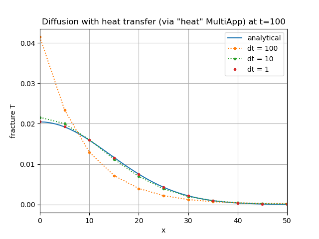
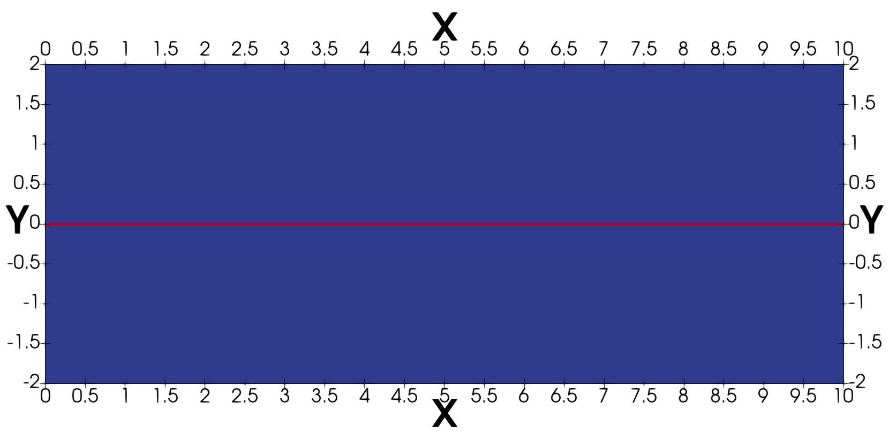
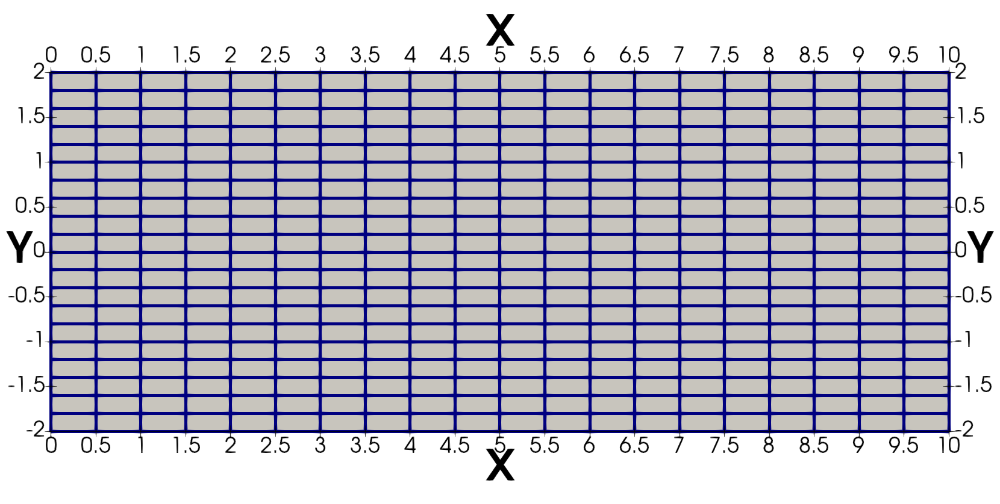
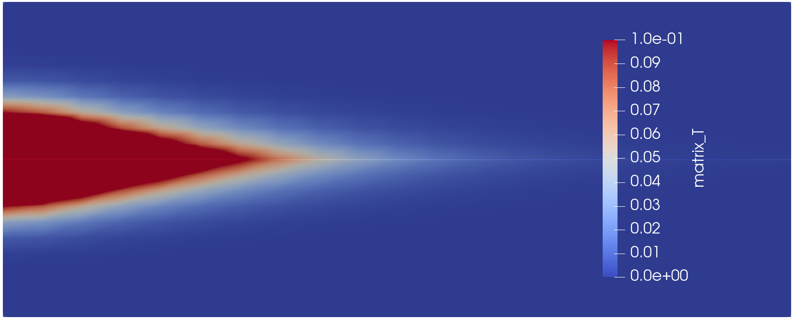
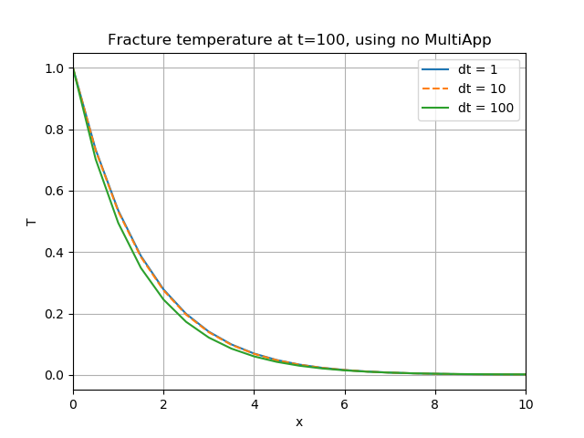
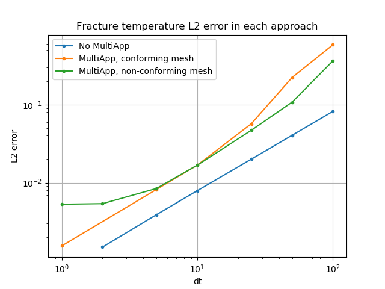

# Fracture flow using a MultiApp approach

A related page [TODO: link] describes how to simulate porous flow in fractured porous media, assuming that the fractures can be incorporated into the mesh as lower dimensional elements, for instance, as 2D "fracture" elements inside a 3D "matrix" mesh.  Unfortunately, realistic fracture networks have such complicated geometry that meshing them is difficult, while incorporating their mesh into a higher-dimensional mesh is almost impossible.  In this page, it is illustrated that MOOSE's MultiApp system may be employed to solve this problem: the "fracture" mesh is governed by one App, which is seperate from the "matrix" mesh that is governed by another App.

## A MultiApp primer using the diffusion equation

Before considering porous flow in a mixed-dimensional fracture-matrix system, consider the simpler situation involving two coupled diffusion equations in 1D.  Introduce the "temperature" variables, $T_{f}$ and $T_{m}$, which obey

\begin{equation}
\begin{aligned}
0 &= \dot{T}_{f} - k_{f}\nabla^{2}T_{f} + h(T_{f} - T_{m}) \ , \\
0 &= \dot{T}_{m} - k_{m}\nabla^{2}T_{m} + h(T_{m} - T_{f}) \ .
\end{aligned}
\end{equation}

In each line, the first two terms are the diffusion equation (with diffusion coefficients $k_{f}$ and $k_{m}$), while the third is heat transfer between the two systems.  The heat transfer coefficient is denoted by $h$.  In applications, the numerical value of $h$ is usually determined by experiment, or by consulting established empirical relationships, such those found on [wikipedia](https://en.wikipedia.org/wiki/Heat_transfer_coefficient).  If $T_{f} > T_{m}$ then the heat-transfer term takes heat energy from the $T_{f}$ system and applies it to the $T_{m}$ system.  It is important that the same numerical value of $h$ is used in both formulae, otherwise heat energy would not be conserved.

In this section, assume the boundary conditions are
\begin{equation}
T_{f}(x = \pm\infty) = 0 = T_{m}(x = \pm\infty)
\end{equation}
and the initial conditions are
\begin{equation}
\begin{aligned}
T_{f}(t = 0) &= \delta(x) \ , \\
T_{m}(t = 0) &= 0 \ ,
\end{aligned}
\end{equation}
where $\delta$ is the Dirac delta functions.  These conditions make the analytic solution easy to derive.

Also, assume that $k_{f} = 1 = k_{m}$.

Physically, this system represents the situation in which the $T_{f}$ system is initially provided with a unit of heat energy at $x=0$, and that heat energy is allowed to disperse under diffusion, and transfer to the $T_{m}$ system, which also disperses it.  To derive the solution, the sum of the two governing equations yields the standard diffusion equation (which may be solved using the [fundamental solution](https://en.wikipedia.org/wiki/Heat_equation)), while the difference yields the diffusion equation augmented with a decay term.  The final result is:
\begin{equation}
\begin{aligned}
T_{f}(t, x) &= \frac{1 + e^{-2ht}}{4\sqrt{\pi t}}\exp\left(-\frac{x^{2}}{4t}\right) \ , \\
T_{m}(t, x) &= \frac{1 - e^{-2ht}}{4\sqrt{\pi t}}\exp\left(-\frac{x^{2}}{4t}\right) \ , \\
\end{aligned}
\end{equation}

### A single variable (no heat transfer)

When $h=0$, the system becomes decoupled.  The solution is $T_{m} = 0$, and $T_{f}$ given by the fundamental solution.  This may be solved by MOOSE without any MultiApp system using the following input file

TODO: listing single_var.i

The result depends on the spatial and temporal discretisation.  The temporal-discretisation dependence is shown below:

### Two coupled variables (no MultiApp)

The system is coupled when $h\neq 0$.  A MultiApp approach is not strictly needed in this case, because there are no meshing problems: the domain is just the real line.  Hence, the system may be solved by MOOSE using the following input file

TODO: listing two_vars.i

The result depends on the spatial and temporal discretisation.  The temporal-discretisation dependence is shown below.  Notice that the matrix has removed heat from the fracture, so the temperature is decreased compared with the $h=0$ case.

### A MultiApp approach

Using a MultiApp approach for the $h\neq 0$ case yields similar results.  The MultiApp methodology used throughout this page is as follows.

1. One timestep of the fracture physics is solved, holding the matrix variables fixed.
2. Transfers from the fracture system to the matrix system are performed.
3. One timestep of the matrix system is solved, holding the fracture variables fixed.
4. Transfers from the matrix system to the fracture system are performed.

Upon reflection, the reader will realise there are many potential ways of actually implementing this.  In the case at hand, the fracture physics ($T_{f}$) is governed by the "main" App, and the matrix physics ($T_{m}$) by the "sub" App.

#### Transfer of heat energy ("heat" MultiApp)

In order to conserve heat energy, the following approach may be used

1. One timestep of the fracture App is solved, holding the $T_{m}$ fixed, using [PorousFlowHeatMassTransfer](PorousFlowHeatMassTransfer.md) Kernel to implement the $h(T_{f} - T_{m})$ term, and recording the heat lost to the matrix, $h(T_{f} - T_{m})$ into an `AuxVariable`.
2. The heat lost to the matrix is transferred to the matrix App.
3. One timestep of the matrix system is solved, using a `CoupledForce` Kernel to inject the heat gained from the fracture at each node.
4. The resulting $T_{m}$ is transferred to the fracture App.

This is implemented using the following `AuxKernel` in the fracture App:

TODO listing fracture_app_heat.i block=AuxKernels

along with the following Transfers:

TODO listing fracture_app_heat.i block=Transfers

and the `Kernel` in the matrix App:

TODO listing matrix_app_heat.i start=[fromFrac] end=[]

A couple of subtleties are that the `CoupledForce` Kernel will smooth the nodal `heat_to_matrix` AuxVariable (since it uses quad-point values) and that a `save_in` cannot be employed in the `frac_app_heat.i` input file [PorousFlowHeatMassTransfer](PorousFlowHeatMassTransfer.md) Kernel (since that would include the nodal volume).  The results are:

#### Transfer of temperature ("T" MultiApp)

An alternative approach is to transfer $T_{m}$ and $T_{f}$:

1. One timestep of the fracture App is solved, holding $T_{m}$ fixed, using [PorousFlowHeatMassTransfer](PorousFlowHeatMassTransfer.md) Kernel to implement the $h(T_{f} - T_{m})$ term.
2. The resulting $T_{f}$ is transferred to the matrix App.
3. One timestep of the matrix system is solved, holding $T_{f}$ fixed, using [PorousFlowHeatMassTransfer](PorousFlowHeatMassTransfer.md) Kernel to implement the $h(T_{f} - T_{m})$ term (using the same $h$ as the fracture App).
4. The resulting $T_{m}$ is transferred to the fracture App.

The disadvantage of this approach is that it doesn't conserve heat energy, however, the advantage is that the original differential equations are clearly evident.  Given that the error of using a MultiApp is $\Delta t$ irrespective of the type of Transfer implemented, the non-conservation of heat energy, which is also proportional to $\Delta t$, is probably not of critical importance.  This idea is implemented using the following `Kernel` in the fracture App:

TODO listing fracture_app.i start=[toMatrix] end=[]

along with the following Transfers:

TODO listing fracture_app.i block=Transfers

and the `Kernel` in the matrix App:

TODO listing fracture_app_heat.i start=[toMatrix] end=[]

The results are:

### Error in each approach

The L2 error in each approach (square-root of the sum of squares of differences between the MOOSE result and the analytical result) is plotted below.  The errors are very similar for each of the models explored in this section.  The magnitude of the error is largely unimportant: the scaling with time-step size is more crucial, and in this case it follows the [expected first-order result](https://web.mit.edu/10.001/Web/Course_Notes/Differential_Equations_Notes/node3.html).

\begin{equation}
\mathrm{L2 error} \propto \mathrm{d}t \ .
\end{equation}

### Final remarks on stability

One aspect that is not captured in this analysis is stability.  The non-MultiApp approaches ("No heat transfer" and "Coupled, no MultiApp") use fully-implicit time-stepping, so are unconditionally stable.  Conversely, the MultiApp approaches break this unconditional stability, which could be important in PorousFlow applications.  For instance, the matrix temperature is "frozen" while the fracture App is solving.  If a very large time-step is taken before the matrix App is allowed to evolve, this would lead to huge, unphysical heat losses to the matrix system.  The fracture temperature could reduce to the matrix temperature during fracture evolution, and then the matrix temperature could rise significantly during its evolution when it receives the large quantity of heat from the fracture.  This oscillation is unlikely to become unstable, but is clearly unphysical.

## The diffusion equation with a mixed-dimensional problem

The "fracture" and "matrix" in the previous section were identical spatial domains.  In this section, the diffusion equation is used to explore a mixed-dimensional problem, where the fracture is a 1D line "living inside" the 2D matrix.  In reality, the fracture has a certain thickness, but it is so small that it may be approximated by a 1D line.  This is important when estimating the heat transfer coefficient, as discussed below.

### Geometry and mesh

There are two cases: "conforming" and "nonconforming".   In the conforming case, all fracture nodes are also matrix nodes: the fracture elements are actually created from a sideset of the 2D matrix elements.  The conforming case is shown in FiguresREF_TODO: the solution domain consists of the `fracture` subdomain (1D red line) and the `matrix` subdomain (in blue), which share nodes.  In the nonconforming case, no fracture nodes coincide with matrix nodes.  The nonconforming case is shown in TODO.

The conforming case is explored using a non-MultiApp approach and a MultiApp approach, while the "nonconforming" case can only be explored using a MultiApp approach.

In all cases, the finite-element mesh dictates the spatial resolution of the numerical solution, and the analysis that follows ignores this by using the same spatial resolution in each model.  However, it is important to remember that in practice, the use of finite elements means the solution is never "exact".  For instance, using large matrix elements will probably lead to poor results.  Large elements also produce more noticable overshoots and undershoots in the solution, which may be observed in the current models if the matrix `ny` is too small.

### Physics

The two variables, $T_{f}$ and $T_{m}$, are the temperature in the fracture and matrix, respectively.  These are called `frac_T` and `matrix_T` in the MOOSE input files.  Each obeys at diffusion equation, with heat transfer between the two variables, as written in Eqn(1)REF_TODO.

However, $T_{f}$ is only defined on the fracture, and $T_{m}$ is only defined on the matrix, and the heat transfer only occurs on the interface between them.  Therefore, in the conforming case, the heat transfer only occurs on the `fracture` subdomain, while in the non-conforming case, the fracture appears as a set of Dirac sources in the `matrix` subdomain.  More precisely, the equation in the matrix domain should be written:

\begin{equation}
0 = \dot{T}_{m} - k_{m}\nabla^{2}T_{m} - H\delta(y) \ ,
\end{aligned}
\end{equation}

where $\delta$ is the Dirac delta function, and $y=0$ is the position of the fracture.  Here,

\begin{equation}
H = h(T_{f} - T_{m}) \ .
\end{equation}

This leads naturally to the MultiApp approach: $H$ is generated as an `AuxVariable` by the `fracture` App, so exists only in the `fracture` subdomain.  It is then passed to the `matrix` App, and applied as a `DiracKernel`.

The boundary conditions are "no flow", except for the very left-hand side of the fracture domain, where temperature is fixed at $T_{f} = 1$.  The initial conditions are $T_{m} = 0 = T_{f}$.

The diffusion coefficient in the fracture is $k_{f} = 1.0$, and is $k_{m} = 10^{-3}$ in the matrix.  The heat transfer coefficient is $h=10^{-3}$.

Each simulation runs with `end_time = 50`.

It is important to understand the mathematical meaning of the heat transfer coefficient, $h$, in this context.  **It must be set proportional to the fracture aperture.**  This is explained in TODO_REF_OTHER_FRACTURE_DOCO.  As further illustration, consider the MultiApp approach without diffusion.  Denote the known temperature values at the start of a time-step by $T_{f}^{0}$ and $T_{m}^{0}$, and those at the end by $T_{f}^{1}$ and $T_{m}^{1}$, which are the unknown values for this time-step.  The fracture equation reads

\begin{equation}
\frac{T_{f}^{1} - T_{f}^{0}}{\Delta t} = h (T_{m}^{0} - T_{f}^{1}) \ .
\end{equation}

The heat-rate from each fracture node is $h(T_{m}^{0} - T_{f}^{1})V_{f}$, where $L_{f}$ is the "volume" modelled by the fracture node.  Since this is a 1D fracture, $L_{f}$ is actually a length, which is numerically equal to half the sum of the lengths of the elements joined to the node.  This heat-rate gets applied to the appropriate matrix nodes: the equation reads

\begin{equation}
\frac{T_{m}^{1} - T_{m}^{0}}{\Delta t} = h (T_{f}^{1} - T_{m}^{0}) \frac{L_{f}}{A_{m}} \ ,
\end{equation}

where $A_{m}$ is the "volume" modelled by the matrix node (actually an area in this 2D situation).  For this to be physically consistent, $h$ must contain information about the fracture aperture, for the hot material in the fracture provides heat at the rate given above, which obviously increases linearly with fracture aperture.

Finally, notice that if $L_{f} \gg A_{m}$ then the "large" fracture node can apply a lot of heat to the "small" matrix node, which causes numerical instability if $\Delta t$ is too large.

### No MultiApp: the benchmark

In the conforming case, a MultiApp approach need not be taken, and the Kernels are:

TODO listing fracture_diffusion/no_multiapp.i block=Kernels

The matrix temperature is shown in FigureTODO_REF

The solution produced by MOOSE depends upon time-step size.  Some examples are shown in FigureTODO_REF.  Evidently, reducing the time-step below 1.0 does not impact the solution very much.  Hence, the solution using $\mathrm{d}t = 0.0625$ is used as the *benchmark* for the remainder of this section.

### A MultiApp approach for the conforming case

In this case, the matrix App is the main App, and the fracture App is the subApp.  The fracture input file has the following features.

- An `AuxVariable` called `transferred_matrix_T` that is $T_{m}$ interpolated to the fracture mesh.

- An `AuxVariable` called `joules_per_s` that is the heat rate coming from each node.  Mathematically this is $h(T_{f} - T_{m})L$, where $L$ is the "volume" modelled by the fracture node.  This is populated by the `save_in` feature:

TODO listing fracture_diffusion/fracture_app_dirac.i block=Kernels

- A `NodalValueSampler` `VectorPostprocessor` that captures all the `joules_per_s` values at each fracture node

TODO listing fracture_diffusion/fracture_app_dirac.i block=VectorPostprocessors

The matrix input file has the following features

- Transfers that send $T_{m}$ to the fracture App, and receive the `joules_per_s` from the fracture App

TODO listing fracture_diffusion/matrix_app_dirac.i block=Transfers

- This latter `Transfer` writes its information into a `VectorPostprocessor` in the matrix App.  That is then converted to a Dirac source by a `VectorPostprocessorPointSource` `DiracKernel`:

TODO listing fracture_diffusion/matrix_app_dirac.i block=DiracKernels

### A MultiApp approach for the nonconforming case

TODO

### Results

The L2 error of the fracture temperature in each approach (square-root of the sum of squares of differences between the $T_{f}$ and the benchmark result) is plotted below.  As expected, the error is proportional to $\Delta t$.  The error when using the MultiApp approaches is larger than the non-MultiApp approach, because $T_{f}$ is fixed when $T_{m}$ is being solved for, and vice versa.

